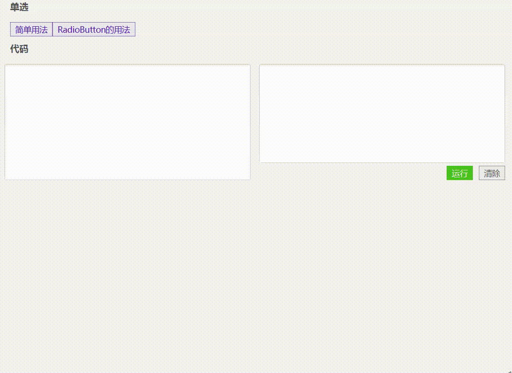

# 单选框/复选框




- 这个checkbox支持


## 使用

```java
//简单用法
XmCheckBox checkbox = new XmCheckBox("label");
```


```java
//泛型用法，用于多个checkbox选中后，直接获取到选中的值。
XmCheckBox<Menu> checkbox = new XmCheckBox<Menu>();
checkbox.setConverter(new XmStringConverter<Menu>() {
    @Override
    public String toString(Menu menu) {
        return menu.getLabel();
    }
});
checkbox.setValue(new Menu("a", "这是label", 1));
```

- setConverter 用于设置checkbox的label显示，前提是要启用泛型
- setValue 设置选中的值

 

```java
//RadioButton的用法
XmStringConverter<Menu> converter = new XmStringConverter<Menu>() {
    @Override
    public String toString(Menu object) {
        return object.getLabel();
    }
};

XmCheckBox<Menu> cb = new XmCheckBox<Menu>();
//设置转换器
cb.setConverter(converter);
cb.setValue(new Menu("1", "女", 1));

XmCheckBox<Menu> cb1 = new XmCheckBox<Menu>();
cb1.setConverter(converter);
cb1.setValue(new Menu("1", "男", 2));

XmCheckBox<Menu> cb2 = new XmCheckBox<Menu>();
cb2.setConverter(converter);
cb2.setValue(new Menu("1", "保密", 3));

XmToggleGroup<Menu> tg = new XmToggleGroup<>();
cb.setToggleGroup(tg);
cb1.setToggleGroup(tg);
cb2.setToggleGroup(tg);

//设置为RadioButton模式, 这个是确保外观是RadioButton样式, 并且不能启用indeterminate属性，
//如果自己能够确保不会出问题，可以不设置这个属性
cb.setRadioButton(true);
cb1.setRadioButton(true);
cb2.setRadioButton(true);

//获取选中1
//tg.getSelectedToggle().getValue();

//获取选中值2
tg.selectedToggleProperty().addListener((ob, ov, nv)->{
    System.out.println(nv.getValue());
});
```


[单选框的实例代码](../../Example/src/main/java/com/xm2013/example/example/page/CheckBoxPage.java)


